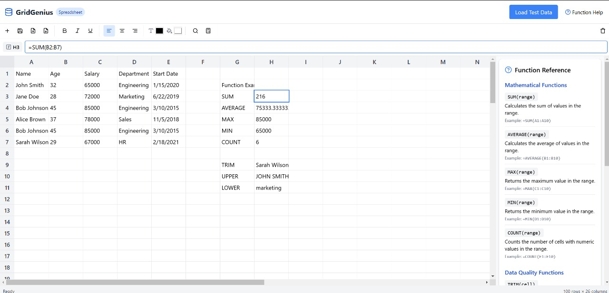
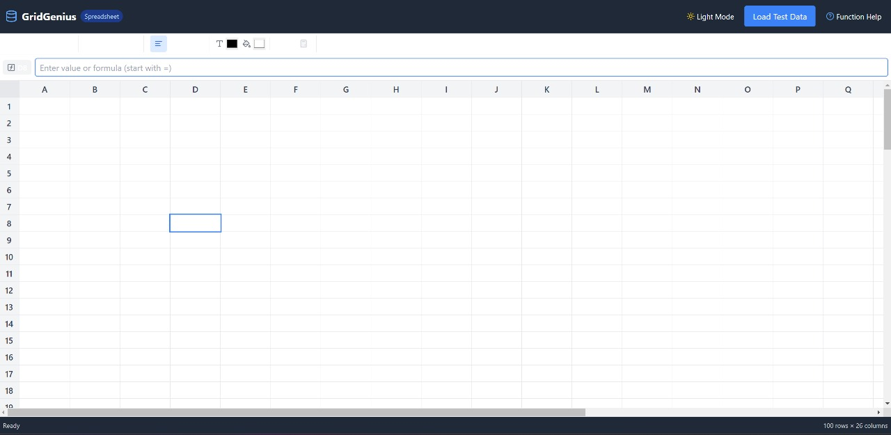

# GridGenius

GridGenius is a powerful and intuitive spreadsheet application inspired by Google Sheets. Built with React, TypeScript, and Tailwind CSS, it offers a seamless user experience for handling tabular data efficiently.

To check it out -click on Grid-Genius["https://grid-genius.vercel.app/"]
## Features

### 1. **Spreadsheet Functionality**
   - Perform calculations, format cells, and manipulate data efficiently.
   - Supports essential spreadsheet operations like inserting, deleting, and modifying rows and columns.
   - **Google Sheets Fidelity**: Includes smooth cell navigation, drag-to-fill functionality, and real-time updates for dependent cells.

### 2. **Formula Support**
   - Allows users to enter mathematical formulas similar to Google Sheets.
   - Example: `=SUM(A1:A10)` calculates the sum of values in the selected range.
   - Supports functions like `SUM`, `AVERAGE`, `MAX`, `MIN`, and `COUNT`.
   - **Cell Dependency Handling**: Formulas update dynamically when referenced cells change, ensuring data integrity.

### 3. **Cell Editing**
   - Click on any cell to edit its value or enter a formula.
   - Dynamic cell updates ensure smooth and efficient data handling.
   - **Real-time Calculation Accuracy**: Implemented formula parsing ensures precision in mathematical operations.

### 4. **Keyboard Shortcuts**
   - Quickly navigate through the spreadsheet using arrow keys.
   - Press `Enter` to edit a cell and `Esc` to cancel the edit.
   - Use `Ctrl + C` and `Ctrl + V` for copy-pasting values.
   - Supports Google Sheets-like shortcuts for efficient workflow.

### 5. **Function Reference Panel**
   - A built-in reference panel displaying available functions and their usage.
   - Helps users quickly access formula documentation without leaving the application.

### 6. **Modern UI with Tailwind CSS**
   - Clean and responsive design for an optimal user experience.
   - Minimalistic interface ensuring focus on the data.
   - **Drag-to-Fill Feature**: Enables users to quickly apply formulas or values to adjacent cells.

### 7. **Bonus Features**
   - **Dark Mode**: Allows users to switch between light and dark themes.
   
## Screenshot

Below are screenshots showcasing GridGenius in action:


---


## Installation

Clone the repository and install dependencies:

```sh
git clone https://github.com/yourusername/GridGenius.git
cd GridGenius
npm install
```
## Usage

Start the development server:

```sh
npm run dev
```

Open your browser and visit `http://localhost:3000` to use GridGenius.

## Technologies Used

- **React** - Component-based UI development for a modular and interactive spreadsheet.
- **TypeScript** - Static typing for better code reliability, ensuring safer refactoring and easier debugging.
- **Tailwind CSS** - Utility-first styling framework for fast and scalable UI design.
- **Context API & Reducer Pattern** - Efficient state management for cell updates and formula calculations.
- **Parsing Engine** - Custom formula parser for handling mathematical expressions accurately.

## Why These Technologies?

- **React & Context API**: Provides a reactive and component-based approach to spreadsheet rendering.
- **TypeScript**: Ensures type safety, preventing common runtime errors in complex calculations.
- **Tailwind CSS**: Speeds up UI development while maintaining a lightweight and maintainable design.
- **Custom Parsing Engine**: Allows implementation of complex formula evaluation and dependency resolution.

## Code Quality & Maintainability

- **Modular Codebase**: Divided into components such as `Cell`, `Row`, and `FormulaParser` for easy scalability.
- **Optimized State Management**: Uses React Context and useReducer for efficient updates.
- **Unit Tests**: Ensures formula accuracy and UI consistency.

## Contributing

Feel free to contribute by submitting issues or creating pull requests.

## License

This project is licensed under the MIT License.

---

🚀 **GridGenius** - Your go-to spreadsheet solution!

